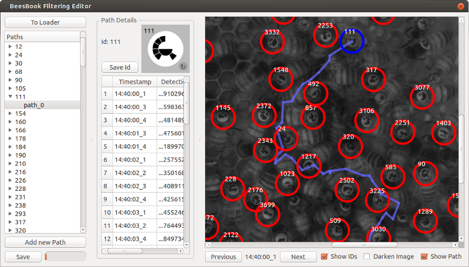

# Editor GUI

A gui for viewing the tracking results and the ground truth paths.

## Editing

Editing is only enabled for ground truth data.
The gui can be used to manually track some ground truth paths.

* Click: add and remove detection from path
* Key A: previous timestamp
* Key D: next timestamp
* Space: next timestamp and if there's a detection next to where the mouse points add it to the path

At the moment the entries in the database are only written and overwritten, never cleared.
So if you remove a detection from a path in the gui, it will remain assigned in the database,
unless you assign it to another path.

