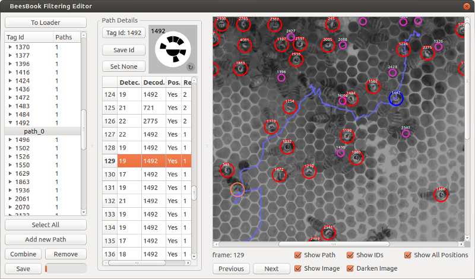

# Editor GUI

A gui for viewing and editing ground truth paths.

The input and output format is described [here](../path-file-format.md).

## Editing

* The table of detections always shows a gapless sequence.
  For not yet tracked frames empty detections are automatically inserted where there would be gaps in the sequence otherwise.
	* These empty detections are only for highlighting the missing parts to the user.
	  Empty detections without a position set aren't saved with the truth paths.
	* Although the gui allows it, it's therefore futile to set the readability for them as long as they don't have a position.
	  After reloading they are automatically inserted with readability 1 again.
* With readability none it's not possible to select detections, only positions.
  Useful when the targeted position lies behind a detection.

### Shortcuts

* A, Left, Up: go to previous timestamp
* D, Right, Down: go to next timestamp
* P: add new path
* R: remove detection on current timestamp (not possible in editing mode)
* E: enter editing mode
* Q: quit editing mode
* Escape: quit editing mode and discard detection on current timestamp, same as Q+R
* C: correct the current detection and leave editing mode immediately, same as E+Q
* 1,2,3: set readability value. ( 1 == completely, 2 == partially, 3 == none )

## Merging

Use the script merge.py to merge two path files.
This solves conflicts with path ids used twice so the paths don't get mixed together.
Which means no paths are actually getting merged.
Also it does not assert that every detection is only used once. This is handled during loading.

## Matching

The generated path files are matched against a specific pipeline output.
That means truth detections are associated with decoded detections by id.
These ids are not necessarily the same for a recalculated pipeline output.
Using the script match.py to match a paths file against a new pipeline output will update the ids.

